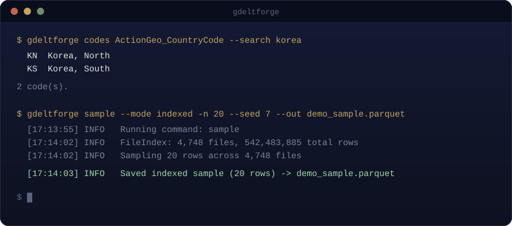

#  GdeltForge

### Forges the raw GDELT 2.0 archive into clean, reproducibly-sampled, cross-referenced Parquet

[](https://github.com/Vinicius-Teixeirac/GdeltForge/actions/workflows/ci.yml)
[](https://github.com/astral-sh/ruff)
[](https://microsoft.github.io/pyright/)
[](LICENSE)
[](https://github.com/Vinicius-Teixeirac/GdeltForge/releases)

📖 **[Full documentation](https://vinicius-teixeirac.github.io/GdeltForge/)**

<p align="center">
  
</p>

GDELT's Events archive spans hundreds of millions of rows across 50+ years, but the official API caps queries at ~250 rows and BigQuery's free tier can't cover a full historical pull. GdeltForge downloads, converts, filters, and reproducibly samples the whole archive locally: checksum-verified downloads, concurrent I/O, and reservoir sampling built for a single pass over the full history. It also scrapes the Global Knowledge Graph (both current GKG 2.1 and legacy GKG 1.0) and Mentions, and can cross-reference a sampled Events output back onto GKG (themes, tone, people, organizations) with `crossref`.

- Full historical archive, not just the last 3 months the API allows
- Events enriched with GKG via `crossref`, preserving the real many-to-many structure instead of collapsing it
- Efficient columnar storage (**Parquet**) instead of raw CSV/ZIP
- Reproducible sampling: indexed, daily, filtered, and stratified modes
- Each stage (`scrape`/`convert`/`filter`/`sample`/`crossref`) runs independently and inspectably

## Contents

- [Challenges with Official Access Methods](#challenges-with-official-access-methods)
- [Comparison to Other GDELT Tools](#comparison-to-other-gdelt-tools)
- [Pipeline Design Principles](#pipeline-design-principles)
- [Installation](#installation)
- [Project Structure](#project-structure)
- [Command Line Interface](#command-line-interface)
- [Usage Examples](#usage-examples)
- [Logging System](#logging-system)
- [Limitations and Roadmap](#limitations-and-roadmap)
- [Contributing](#contributing)
- [License](#license)

---

## Stack

[](https://www.python.org/)
[](https://docs.astral.sh/uv/)
[](https://arrow.apache.org/docs/python/)
[](https://pandas.pydata.org/)
[](https://numpy.org/)
[](https://requests.readthedocs.io/)
[](https://selenium-python.readthedocs.io/)

## Challenges with Official Access Methods

The GDELT Events Database is extremely rich, but extracting the full archive through official methods is difficult. This pipeline solves the following issues:

### GDELT API Limitations

The standard GDELT APIs are optimized for *recent* and *small* queries. They impose strict limits on:

- time windows (often only the last 3 months)
- maximum rows per query (≈ 250)
- request rate limits

These constraints make it effectively impossible to retrieve the **full historical dataset**.

### Google BigQuery Mirror Constraints

While BigQuery provides full access, it suffers from practical issues:

- free-tier quotas (1TB/month query, 10GB storage, 1GB egress) are far too small for the ~hundreds of GB required
- full-table scans are expensive without billing
- some researchers prefer *local* offline workflows

### Raw Bulk Downloads Are Available, But Hard to Use

The [raw GDELT 2.0 archives](https://data.gdeltproject.org/events/) contain **thousands of files**. Processing them requires:

- automated downloading
- streaming or chunked processing
- efficient columnar storage (Parquet)
- memory-safe filtering and sampling

This pipeline automates these steps end-to-end.

## Comparison to Other GDELT Tools

GdeltForge's genuinely distinguishing feature is treating **reproducible sampling as a first-class pipeline stage**, not download-and-convert alone: seeded indexed, daily, filtered, and stratified reservoir sampling over the full archive in a single streaming pass. The other is `crossref`: GKG 2.1 carries no event ID at all, only the source article's URL, so joining it to Events means a two-hop trip through Mentions that's easy to get subtly wrong; `crossref` does that join with filter pushdown and keeps the real many-to-many structure intact instead of silently collapsing it.

See [Comparison to Other Tools](https://vinicius-teixeirac.github.io/GdeltForge/comparison/) for an honest breakdown of when GdeltForge fits and when a DOC API client, BigQuery, or an existing Spark/DuckDB pipeline is the better choice.

## Pipeline Design Principles

The pipeline follows a **single-responsibility, single-stage execution model**. Each command performs *exactly one* transformation:

| Stage | Does |
|-------|------|
| `scrape` | download raw GDELT CSV files (Events, GKG 2.1, GKG 1.0, or Mentions) |
| `convert` | transform CSV -> Parquet |
| `filter` | remove rows with missing values |
| `sample` | reproducibly sample from Parquet files |
| `crossref` | join a sampled Events output back onto GKG |

This design is intentionally **transparent and low-magic**:

- every operation is explicit
- no hidden steps
- each module is individually testable
- any stage can be re-run without affecting others

### High-Level Architecture

```
┌─────────────┐      ┌─────────────┐      ┌─────────────┐      ┌─────────────┐      ┌─────────────┐
│   Scraper   │ ---> │  Converter  │ ---> │   Filter    │ ---> │   Sampler   │ ---> │  Crossref   │
└─────────────┘      └─────────────┘      └─────────────┘      └─────────────┘      └─────────────┘
      CSV                Parquet            Cleaned data         Sampled data      Sample + GKG data
```

The same four stages (scrape/convert/filter) run independently per dataset (`--dataset events`, `gkg-v2`, `mentions`, ...); `crossref` is the one stage that reads two datasets at once, joining a sampled Events output against a GKG dataset processed the same way.

Each stage consumes the output of the previous one, enabling:

- incremental execution
- streaming-friendly operations
- memory-efficient processing
- simple debugging
- reusable intermediate data

## Installation

```
pip install gdeltforge
gdeltforge --help
```

No config file required to get started: GdeltForge falls back to a conservative built-in default (real `./data/...` paths, no row/column filtering) and writes it to `config/settings.yaml` the first time you run a command with nothing else configured, so it works immediately in a fresh environment like a Colab session. See [Configuration](https://vinicius-teixeirac.github.io/GdeltForge/configuration/) to customize it instead.

### Installing from source

For contributing to GdeltForge itself, or an editable install. This project uses [uv](https://docs.astral.sh/uv/) for dependency management; `uv sync` builds and installs GdeltForge itself (editable), so the `gdeltforge` command becomes available inside the virtual environment.

```
# Install uv (if not already installed)
pip install uv

git clone https://github.com/Vinicius-Teixeirac/GdeltForge.git
cd GdeltForge

# Create virtual environment, install dependencies, and install GdeltForge itself
uv sync

# Activate the virtual environment
# Windows
.venv\Scripts\activate
# macOS / Linux
source .venv/bin/activate

# Verify the CLI is installed
gdeltforge --help
```

Optional, but worth doing for a real project rather than accepting the built-in default: copy the example config and adjust paths:

```
cp config/settings.example.yaml config/settings.yaml
```

### Running Tests

The test suite is pure unit tests (no network access, no browser, no real GDELT data required) covering the scraping and conversion logic.

```
uv sync --group dev
uv run pytest
```

## Project Structure

GdeltForge follows a standard `src/` package layout, installable via `uv sync` / `pip install`:

```
project_root/
├── config/
│ └── settings.yaml # Global configuration for all pipeline stages
│
├── src/gdeltforge/
│ ├── py.typed # PEP 561 marker: this package ships inline type hints
│ ├── cli.py # Argument parsing + subcommand dispatch (the gdeltforge entry point)
│ │
│ ├── conversion/
│ │ └── converter.py # CSV -> Parquet conversion logic
│ │
│ ├── crossref/
│ │ └── crossref.py # Events<->GKG join (direct for GKG 1.0, two-hop via Mentions for GKG 2.1)
│ │
│ ├── filtering/
│ │ └── filter.py # Filtering logic (drop invalid rows)
│ │
│ ├── sampling/
│ │ ├── cameo_codes.py # Bundled CAMEO/FIPS reference data, backs the `codes` command
│ │ ├── indexer.py # File indexing for reproducible sampling
│ │ ├── rng.py # Random number generation helpers
│ │ └── samplers.py # Indexed, daily, and filtered sampling
│ │
│ ├── scraping/
│ │ └── scraper.py # Downloader for Events, GKG 2.1, GKG 1.0, and Mentions
│ │
│ └── utils/
│   ├── config.py # Config resolution (--config / env var / CWD) and YAML loading
│   ├── io.py # File and chunked-IO helpers
│   └── logging.py # Central logging system
│
├── tests/ # pytest suite (unit tests, no network/browser required)
│
├── main.py # Backward-compatible shim: `python main.py <command>` still works
├── pyproject.toml # Package metadata, build backend, gdeltforge console-script entry point
└── README.md
```

## Command Line Interface

Run pipeline stages using the installed console script:

```
gdeltforge <command> [options]
```

`python main.py <command> [options]` is kept as a backward-compatible equivalent, so existing scripts keep working unchanged.

Available commands:

| Command | Description |
|---------|-------------|
| scrape  | Download raw GDELT data (ZIP -> CSV) |
| convert | Convert downloaded CSV files to Parquet |
| filter  | Apply row-column filtering to Parquet files |
| sample  | Efficient, reproducible sampling |
| crossref | Join a sampled Events output back onto GKG |
| codes   | Look up valid CAMEO/FIPS codes across seven column families |

The CLI intentionally does not chain stages automatically. You run each stage explicitly to maintain full control.

By default the config is read from `./config/settings.yaml` (relative to wherever you run the command from). To point at a config file anywhere else on disk, use `--config /path/to/settings.yaml` or set the `GDELTFORGE_CONFIG` environment variable, useful once GdeltForge is installed and invoked from outside the repo checkout. If none of those resolve to a real file, GdeltForge falls back to a built-in default instead of failing; see [Configuration](https://vinicius-teixeirac.github.io/GdeltForge/configuration/).

## Usage Examples

Below are practical, beginner-friendly examples covering all common workflows.

### Scrape Raw Data

Download the entire archive:
```
gdeltforge scrape
```

Download only files within a date range (any combination of bounds is valid):
```
gdeltforge scrape --start-date 2020-01-01 --end-date 2023-12-31
gdeltforge scrape --start-date 2022-01-01          # from date onward
gdeltforge scrape --end-date   2015-12-31          # up to date
```

The filter applies to all three file types the GDELT archive provides:

| File type | Example filename | Included when |
|-----------|-----------------|---------------|
| Daily | `20200315.export.CSV.zip` | day falls within range |
| Monthly | `202003.zip` | month overlaps range |
| Yearly | `2020.zip` | year overlaps range |

Files already present in the download directory are skipped regardless of the date filter.

Downloads run concurrently (`scraping.max_workers` in `config/settings.yaml`, default `8`) and are checksum-verified: the GDELT index publishes an MD5 per file, which the scraper captures and checks against each download after it completes. A mismatch is treated the same as a network failure: the file is discarded and retried up to `scraping.retries` times before being reported as failed, so a corrupted or truncated download never silently ends up in the dataset.

#### Link Collection Method: `requests` vs `selenium`

The scraper needs to read the file index at `data.gdeltproject.org/events/` before it can download anything. That index turns out to be a plain, server-rendered HTML directory listing (not JS-rendered), so a headless browser is unnecessary overhead. `scraping.method` in `config/settings.yaml` controls which collector is used:

| | `requests` (default) | `selenium` |
|---|---|---|
| How it works | Plain HTTP GET + regex over the HTML | Launches headless Chrome, waits for the DOM, reads `<a>` tags |
| Dependencies | Just `requests` (already required) | Chrome install + a version-matched ChromeDriver + `selenium`/`webdriver-manager` (`uv pip install '.[selenium]'`) |
| Measured speed | ~0.4s | ~16s (~40x slower) |
| Failure modes | None specific to this site | Breaks whenever Chrome auto-updates past the pinned ChromeDriver version (the original reason this option was added) |
| When to use | Always, unless the page below stops being static | Fallback only, in case GDELT ever switches this index page to a JS-rendered listing |

Both methods were verified to return an identical set of URLs (4,953 files). Timing was a single wall-clock run of each method's link-collection call only (`_collect_gdelt_links_requests` / `_collect_gdelt_links_selenium`, timed with `time.perf_counter()`), back-to-back against the live site on the same machine/network: it does *not* include the subsequent file downloads, which are identical for both methods. It's a one-off measurement, not an average over multiple runs, so treat the ~40x figure as indicative of the order of magnitude rather than a precise benchmark; the gap is structural (Chrome process startup + page-render wait vs. a single HTTP GET), so it should hold up under repeated measurement.

The site's TLS certificate doesn't match its hostname (it's served off a GCS bucket cert), so both methods intentionally skip certificate verification for this one connection; the actual file downloads happen over plain `http://`, which sidesteps the issue entirely.

### Convert CSV to Parquet

```
gdeltforge convert
```
Extracts all CSV files from the downloaded ZIP archives and converts them to Parquet files. Each ZIP is processed independently, so conversion runs across a pool of worker processes (`converter.max_workers` in `config/settings.yaml`; `null`, the default, uses all available CPU cores).

#### Optional: Hive Partitioning for Historical Data

The GDELT archive distributes pre-2013 data in yearly and monthly ZIPs (e.g. `1979.zip`, `200601.zip`) rather than daily files. When you are working with the full archive (1971-2025), keeping those as flat Parquet files means every query scans thousands of files. Enabling Hive partitioning routes those files into a structured directory tree, so filters on `Year` or `MonthYear` skip irrelevant files entirely.

**This feature is off by default.** To enable it, add the following to `settings.yaml`:

```yaml
paths:
  # existing paths ...
  parquet_historical_directory: "./data/events/historical"
  filtered_historical_directory: "./data/events/filtered_historical"

converter:
  partitioning:
    enabled: true
    rules:
      - file_type: yearly    # e.g. 1979.zip
        by: ["Year"]
      - file_type: monthly   # e.g. 200601.zip
        by: ["Year", "MonthYear"]
```

With partitioning enabled, running `gdeltforge convert` produces two separate output areas:

```
data/events/
├── parquet/                  # daily files (2013-present), unchanged
│   ├── 20130401.export.parquet
│   └── ...
└── historical/               # yearly/monthly files, Hive-organized
    ├── Year=1979/
    │   └── 1979.parquet
    ├── Year=2006/
    │   └── MonthYear=200601/
    │       └── 200601.parquet
    └── ...
```

Daily ZIPs (2013-present) always go to `parquet_data_directory` as flat files. Yearly and monthly ZIPs go to `parquet_historical_directory` under the directory structure defined by their rule.

Historical ZIPs that have already been converted are tracked with `.done` marker files, so re-running `convert` skips them safely.

All downstream stages (`filter`, `sample`) detect the historical directory automatically from the config and include its data without any extra flags.

`convert` also accepts `--start-date`/`--end-date`, same as `scrape`, narrowing which already-downloaded ZIPs get converted:

```
gdeltforge convert --start-date 2020-01-01 --end-date 2020-12-31
```

### Filter the Parquet Dataset
```
gdeltforge filter
```
Drops rows with missing values in the columns defined in settings.yaml. Also accepts `--start-date`/`--end-date`, narrowing which already-converted files get read (which *files* get filtered, not which rows survive within them).

### Sampling

All sampling modes read from the filtered directory by default. Pass `--source converted` to sample from raw converted Parquet instead, skipping the `filter` stage entirely.

> Note: sampling is already as memory-friendly as the underlying data volume allows, but `--source converted` will still use noticeably more RAM than the default, since it isn't working from data that's already had its missing-value rows dropped.

#### Indexed Sampling (Uniform Random)
```
gdeltforge sample --mode indexed -n 10000 --seed 123 --out sample.parquet
```
This samples 10000 instances considering the entire data.

#### Daily Sampling (N Rows Per Day)
```
gdeltforge sample --mode daily --per-day 20 --out daily.parquet
```
This samples 20 instances per day from the entire period (1971 - 20xx)

#### Filtered Sampling (Using JSON Filters)

* Example: 5000 events whose QuadClass is in {1,2}:

  ```
  gdeltforge sample \
      --mode filtered \
      --filter '{"QuadClass": [1, 2]}' \
      -n 5000 \
      --out qc12.parquet
  ```

* Example: 2000 "Verbal Cooperation" events that happened in "USA":

  ```
  gdeltforge sample \
      --mode filtered \
      --filter '{"ActionGeo_CountryCode": ["USA"], "QuadClass": [1]}' \
      -n 2000
  ```

* Example: You can select specific columns of interest, which is a memory friendly practice:

  ```
  gdeltforge sample \
      --mode filtered \
      --filter '{"ActionGeo_CountryCode": ["USA"], "QuadClass": [1]}' \
      --columns GlobalEventID Year Actor1Code \
      -n 1000
  ```
  It outputs 1000 instances following the same rule as before, but this time with only three columns.

#### Stratified Sampling (Fixed N Per Group)

Combines a filter with stratified reservoir sampling: draws exactly `--n-per-group` rows for each distinct value of a chosen column.

```
gdeltforge sample \
    --mode filtered \
    --filter '{"ActionGeo_CountryCode": ["USA"]}' \
    --stratify QuadClass \
    --n-per-group 500 \
    --out stratified.parquet
```

This produces a balanced dataset with 500 USA events per QuadClass value, regardless of the natural class distribution.

`--stratify` requires `--n-per-group`. The `-n` flag is ignored when `--stratify` is set.

### Cross-Referencing Events with GKG

`crossref` enriches a sampled Events output with GKG (themes, tone, people, organizations). `--gkg-version` picks the join strategy: GKG 1.0 carries `EventIds` directly (a direct join), while GKG 2.1 carries no event ID at all and needs a two-hop join through Mentions on the source article's URL. `--gkg-version auto` attempts every eligible event against both generations instead of requiring one for the whole sample, useful for a sample spanning both eras (GKG 2.1/Mentions don't exist before 2015-02-18; GKG 1.0 has covered everything since 2013-04-01, and remains live today). All preserve the real many-to-many structure (one event can produce several output rows, one article covering several events contributes one row per event) instead of collapsing it.

```
gdeltforge scrape --dataset gkg-v2
gdeltforge scrape --dataset mentions
gdeltforge convert --dataset gkg-v2
gdeltforge convert --dataset mentions
gdeltforge filter --dataset gkg-v2
gdeltforge filter --dataset mentions

gdeltforge crossref \
    --events sample.parquet \
    --gkg-version v2 \
    --out sample_with_gkg.parquet
```

See [Recipes](https://vinicius-teixeirac.github.io/GdeltForge/recipes/#gkg-enriched-events) for the GKG 1.0 direct-join variant and more detail.

### Full Pipeline Examples

#### Full pipeline: sample 10,000 rows
```
gdeltforge scrape
gdeltforge convert
gdeltforge filter
gdeltforge sample --mode indexed -n 10000
```
#### Reproducible sampling
```
gdeltforge scrape
gdeltforge convert
gdeltforge filter
gdeltforge sample --mode indexed -n 5000 --seed 42
```
#### USA-only events
```
gdeltforge scrape
gdeltforge convert
gdeltforge filter
gdeltforge sample \
    --mode filtered \
    --filter '{"ActionGeo_CountryCode": ["USA"]}' \
    -n 3000
```

#### 30 Events Per Day
```
gdeltforge scrape
gdeltforge convert
gdeltforge filter
gdeltforge sample --mode daily --per-day 30
```

#### Bash One-Liner
```
gdeltforge scrape && \
gdeltforge convert && \
gdeltforge filter && \
gdeltforge sample --mode indexed -n 10000
```

#### PowerShell Loop
```
foreach ($c in "scrape", "convert", "filter") {
    gdeltforge $c
}
gdeltforge sample --mode indexed -n 10000
```

#### Date-restricted pipeline
```
gdeltforge scrape --start-date 2020-01-01 --end-date 2023-12-31
gdeltforge convert
gdeltforge filter
gdeltforge sample --mode indexed -n 10000
```
The date flags apply only to `scrape`. The subsequent stages operate on whatever files are already on disk.

### Further Examples

The complete filtered-sampling syntax reference and a full set of runnable recipes are in the documentation: see [Filtered Sampling](https://vinicius-teixeirac.github.io/GdeltForge/filtered-sampling/) and [Recipes](https://vinicius-teixeirac.github.io/GdeltForge/recipes/).

## Logging System

Logging is enabled through a shared logger helper:

```
from gdeltforge.utils.logging import get_logger
logger = get_logger(__name__)
```

Logging to a file:

```
logger = get_logger(__name__, log_to_file=True)
```

## Limitations and Roadmap

GdeltForge is intentionally simple: one pipeline stage per command (no automatic chaining or dependency resolution), CSV -> Parquet only, and `scrape`/`convert`/`filter` now exit non-zero if any individual file fails.

The full, current list of limitations and the roadmap live in one place, the docs site, rather than duplicated here where they'd inevitably drift: see [Limitations & Roadmap](https://vinicius-teixeirac.github.io/GdeltForge/limitations-and-roadmap/).

## Contributing

Contributions are welcome. See [CONTRIBUTING.md](.github/CONTRIBUTING.md) for dev setup, the branch/commit conventions this repo follows, and how to propose a change. Please also read the [Code of Conduct](.github/CODE_OF_CONDUCT.md).

See [CHANGELOG.md](CHANGELOG.md) for a history of notable changes.

Found a security issue? See [SECURITY.md](.github/SECURITY.md) rather than opening a public issue.

## License

This project is licensed under the Apache License, Version 2.0. See the [LICENSE](LICENSE) file for details.
