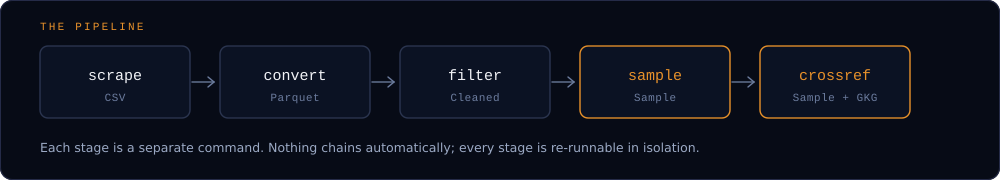

# Architecture

## Design principles

GdeltForge follows a **single-responsibility, single-stage execution model**: each command performs exactly one transformation.

| Stage | Does |
|-------|------|
| `scrape` | download raw GDELT CSV files |
| `convert` | transform CSV -> Parquet |
| `filter` | remove rows with missing values |
| `sample` | reproducibly sample from Parquet files |
| `crossref` | join a sampled Events output back onto GKG |

This is intentionally transparent and low-magic:

- every operation is explicit
- no hidden steps
- each module is individually testable
- any stage can be re-run without affecting the others



The same stages run independently per dataset (`--dataset events`, `gkg-v2`, `mentions`, ...). `crossref` is the one stage that reads two datasets at once, joining a sampled Events output against a GKG dataset processed the same way.

Each stage consumes the previous stage's output, which gives you:

- incremental execution (re-run only the stage you need)
- streaming-friendly operations (batched/chunked reads, not full loads)
- memory-efficient processing on datasets much larger than RAM
- simple debugging (inspect intermediate Parquet at any point)
- reusable intermediate data (multiple sampling runs off one filtered dataset)

## Project structure

GdeltForge is a standard installable `src/` package. Each package under `src/gdeltforge/` corresponds to one pipeline stage, plus `utils/` for shared, stage-agnostic helpers (config loading, logging, I/O).

??? abstract "Full source tree"

    ```text
    project_root/
    ├── config/
    │ └── settings.example.yaml # Annotated starting point; copy to settings.yaml and edit
    │
    ├── src/gdeltforge/
    │ ├── py.typed # PEP 561 marker: this package ships inline type hints
    │ ├── cli.py # Argument parsing + subcommand dispatch (the gdeltforge entry point)
    │ ├── _version.py # Generated at build time from the git tag (hatch-vcs); not hand-edited
    │ │
    │ ├── config/
    │ │ └── default_settings.yaml # Bundled fallback config, used when no settings.yaml/--config is found at all
    │ │
    │ ├── data/
    │ │ └── cameo_codes.json # Bundled CAMEO/FIPS code -> name reference data, backs the `codes` command
    │ │
    │ ├── conversion/
    │ │ └── converter.py # CSV -> Parquet conversion logic
    │ │
    │ ├── crossref/
    │ │ └── crossref.py # Events<->GKG join (direct for GKG 1.0, two-hop via Mentions for GKG 2.1)
    │ │
    │ ├── filtering/
    │ │ └── filter.py # Filtering logic (drop invalid rows)
    │ │
    │ ├── sampling/
    │ │ ├── cameo_codes.py # Loads data/cameo_codes.json, groups columns by code family, backs the `codes` command
    │ │ ├── indexer.py # File indexing for reproducible sampling
    │ │ ├── rng.py # Random number generation helpers
    │ │ └── samplers.py # Indexed, daily, and filtered sampling
    │ │
    │ ├── scraping/
    │ │ └── scraper.py # Downloader for Events, GKG 2.1, GKG 1.0, and Mentions
    │ │
    │ └── utils/
    │   ├── branding.py # Terminal ANSI colors and the --version banner (brand system's terminal voice)
    │   ├── config.py # Config resolution (--config / env var / CWD / bundled default) and YAML loading
    │   ├── io.py # File and chunked-IO helpers
    │   └── logging.py # Central logging system
    │
    ├── docs/assets/brand/ # Emblem, favicon, wordmark lockups, icon set, GitHub social preview
    ├── tests/ # pytest suite (unit tests, no network/browser required)
    │
    ├── main.py # Backward-compatible shim: `python main.py <command>` still works
    ├── pyproject.toml # Package metadata, build backend, gdeltforge console-script entry point
    └── README.md
    ```

## Logging

Logging goes through a shared helper used consistently across every module:

```python
from gdeltforge.utils.logging import get_logger
logger = get_logger(__name__)
```

To also log to a file (used by the CLI entrypoint itself):

```python
logger = get_logger(__name__, log_to_file=True)
```

File logs land in `logs/pipeline.log`, relative to the current working directory.
