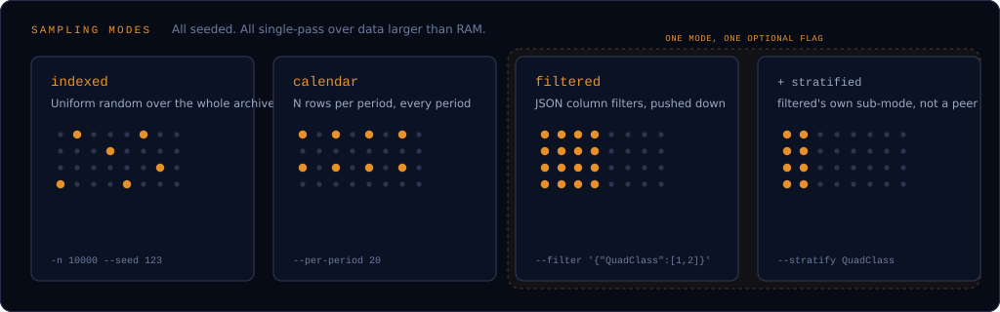

# CLI Reference

```bash
gdeltforge <command> [options]
```

The CLI intentionally does not chain stages automatically: you run each one explicitly to maintain full control. `python main.py <command>` is kept as a backward-compatible alias.

| Command | Description |
|---------|-------------|
| `scrape`  | Download raw GDELT data (ZIP -> CSV) |
| `convert` | Convert downloaded CSV files to Parquet |
| `filter`  | Apply row-column filtering to Parquet files |
| `sample`  | Efficient, reproducible sampling |
| `crossref` | Enrich a sampled Events output with GKG (themes, tone, people, organizations) |
| `codes`   | Look up valid CAMEO/FIPS codes for filter values |

<div class="gf-grid gf-grid--3">
  <a class="gf-card gf-card--link" href="#gdeltforge-scrape"><h3>scrape →</h3><p>Download the raw archive, checksum-verified.</p></a>
  <a class="gf-card gf-card--link" href="#gdeltforge-convert"><h3>convert →</h3><p>CSV to Parquet, optionally Hive-partitioned.</p></a>
  <a class="gf-card gf-card--link" href="#gdeltforge-filter"><h3>filter →</h3><p>Drop rows missing your configured columns.</p></a>
  <a class="gf-card gf-card--link" href="#gdeltforge-sample"><h3>sample →</h3><p>Indexed, daily, filtered, stratified.</p></a>
  <a class="gf-card gf-card--link" href="#gdeltforge-crossref"><h3>crossref →</h3><p>Join a sample back onto GKG.</p></a>
  <a class="gf-card gf-card--link" href="#gdeltforge-codes"><h3>codes →</h3><p>Look up CAMEO/FIPS values offline.</p></a>
</div>

!!! info "Exit codes"

    `scrape`, `convert`, and `filter` all exit non-zero if any individual file failed, even though the ones that succeeded are kept, so a partial failure never gets missed in a `&&`-chained or scripted run. The failed filenames are included in the error message; the per-file reason is in the log output above it.

    Any command that fails prints `Error: <message>` to stderr and exits with status 1, rather than a raw Python traceback; interrupting a command with Ctrl+C prints `Interrupted.` and exits with status 130.

## Global options

`--config PATH`

: Path to `settings.yaml`. Defaults to the `GDELTFORGE_CONFIG` environment variable, then `./config/settings.yaml` relative to the current working directory. Use this (or the env var) to run `gdeltforge` from outside the repo checkout, pointing at a config file anywhere on disk.

## `gdeltforge scrape`

Download the entire archive:

```bash
gdeltforge scrape --dataset events
```

Download only files within a date range (any combination of bounds is valid):

```bash
gdeltforge scrape --dataset events --start-date 2020-01-01 --end-date 2023-12-31
gdeltforge scrape --dataset events --start-date 2022-01-01          # from date onward
gdeltforge scrape --dataset events --end-date   2015-12-31          # up to date
```

| Flag | Description |
|------|-------------|
| `--dataset {events,events-15min,events-reduced,gkg-v1,gkg-v1-counts,gkg-v2,mentions}` | Which GDELT dataset to scrape (required; see [`--dataset`](#-dataset) below) |
| `--start-date YYYY-MM-DD` | Only download files whose period starts on or after this date |
| `--end-date YYYY-MM-DD` | Only download files whose period ends on or before this date |
| `--order {asc,desc}` | Processing order: `asc` (oldest first, the default) or `desc` (newest first) |
| `--verbose` | Show per-attempt download detail (filename, attempt N/M) instead of just the progress bar and summary. Off by default |
| `--quiet` | Suppress even the default setup/summary lines, leaving only warnings and errors. Off by default |
| `-q` | Shorthand for `--quiet` |
| `--force` | Re-download files that already exist locally instead of skipping them. Off by default |
| `--dry-run` | Report how many files would be downloaded and skipped without downloading anything. Off by default |

`--dataset gkg-v2`/`mentions`/`events-15min` publish every 15 minutes rather than daily, so a wide date range can imply far more files than the equivalent daily `events` scrape; see [`--dataset`](#-dataset) below. `gkg-v1`/`gkg-v1-counts` are daily, like `events`, so this doesn't apply to them.

The date filter applies to all three file types the GDELT archive provides:

| File type | Example filename | Included when |
|-----------|-----------------|---------------|
| Daily | `20200315.export.CSV.zip` | day falls within range |
| Monthly | `202003.zip` | month overlaps range |
| Yearly | `2020.zip` | year overlaps range |

Files already present in the download directory are skipped regardless of the date filter, so re-running `scrape` is safe and incremental.

Downloads run concurrently (`scraping.max_workers`, default `8`) and are checksum-verified against the MD5 GDELT publishes for each file: a mismatch is treated like a network failure and retried, so a corrupted or truncated download never silently ends up in the dataset. See [Configuration](configuration.md#scraping) for the `requests` vs `selenium` link-collection method and the full list of scraping settings.

`--quiet` raises the logger to WARNING, suppressing the setup and summary lines `scrape` otherwise always prints; mutually exclusive with `--verbose`.

`--force` re-downloads a file even when one with the same name is already present, overwriting it. `--dry-run` reports how many files would be downloaded versus skipped, honoring `--force`'s effect on that count, without making any network request.

`--order` picks which files are submitted to the download pool first: `asc` (the default) matches `convert`/`filter`/`sample`/`crossref`'s own existing file order, so an interrupted scrape leaves a contiguous prefix of history those stages can already process cleanly; `desc` prioritizes the most recent files, useful when the goal is current data rather than a full backfill. It only controls submission order, not real completion order: downloads run concurrently, so a later-submitted small file can still finish before an earlier-submitted large one.

## `gdeltforge convert`

```bash
gdeltforge convert --dataset events
```

Extracts all CSV files from the downloaded ZIP archives and converts them to Parquet. Each ZIP is processed independently, so conversion runs across a pool of worker processes (`converter.max_workers`; `null`, the default, uses all available CPU cores). A bare `.csv` matched by `converter.file_pattern` (e.g. `"*.csv"`, for a file that didn't come from a fresh `scrape`) is read directly instead, with no extraction step; see [Configuration](configuration.md#converter).

| Flag | Description |
|------|-------------|
| `--dataset {events,events-15min,events-reduced,gkg-v1,gkg-v1-counts,gkg-v2,mentions}` | Which GDELT dataset to convert (required; see [`--dataset`](#-dataset) below) |
| `--start-date YYYY-MM-DD` | Only convert files whose period starts on or after this date |
| `--end-date YYYY-MM-DD` | Only convert files whose period ends on or before this date |
| `--order {asc,desc}` | Processing order: `asc` (oldest first, the default) or `desc` (newest first) |
| `--delete-source` | Delete each source ZIP once its parquet output is written and confirmed done. Off by default |
| `--verbose` | Show per-file conversion detail (which ZIP is being processed, which are skipped as already done) instead of just the progress bar and summary. Off by default |
| `--quiet` | Suppress even the default setup/summary lines, leaving only warnings and errors. Off by default |
| `-q` | Shorthand for `--quiet` |
| `--force` | Reprocess ZIPs already marked done instead of skipping them, overwriting their parquet output. Off by default |
| `--dry-run` | Report how many ZIPs would be converted without converting anything. Off by default |

`--start-date`/`--end-date` narrow which already-downloaded ZIPs get converted, the same date filter `scrape` applies to what gets downloaded:

```bash
gdeltforge convert --dataset events --start-date 2020-01-01 --end-date 2020-12-31
```

Already-converted files are skipped on a rerun, the same way `scrape` skips already-downloaded files; an interrupted run resumes rather than starting over. See [Configuration](configuration.md#resumability) for how that marker also tracks `output_columns`/`compression`, so a config change is reprocessed rather than skipped.

`--order` picks which ZIPs are submitted to the worker pool first, same meaning and same "submission order, not completion order" caveat as `scrape`'s own `--order`. Unlike `scrape`, `convert`'s file discovery has no inherent order of its own to preserve or override (it lists the download directory, not a remote listing), so `--order` is the only thing that makes this deterministic at all.

`--delete-source` reclaims the raw ZIP's disk space once its parquet output is confirmed written, so a full historical pull doesn't need to hold the raw archive and the converted output at once. Only the ZIP; the intermediate extracted CSV is already removed unless `converter.keep_unzipped` is set. Never deletes on a failed conversion, and never runs ahead of the `.done` marker. Combined with `output_columns`, the columns it dropped can't be recovered later without re-scraping the original file, so a warning fires once at the start of a run configured that way.

By default `convert` shows a setup line, a progress bar, and an end-of-run summary, the same shape `scrape` always has. At `gkg-v2`/`mentions` scale (hundreds of thousands of 15-minute files) the per-file detail this used to always print became hundreds of thousands of terminal lines fighting the progress bar for the screen; `--verbose` restores it for whoever actually wants to watch file-by-file. `--quiet` goes the other way, raising the logger to WARNING and suppressing even the setup/summary lines; mutually exclusive with `--verbose`.

`--force` bypasses the `.done` marker check, reprocessing and overwriting output for ZIPs already converted under the current configuration. `--dry-run` reports how many ZIPs would be converted, honoring `--force`'s effect on that count, without processing anything.

See [Configuration](configuration.md#hive-partitioning-for-historical-data) for the optional Hive-partitioning feature for pre-2013 yearly/monthly source files.

## `gdeltforge filter`

```bash
gdeltforge filter --dataset events
```

Drops rows with missing values in the columns defined under `filter.columns_to_check.<dataset>` in `settings.yaml`. Each file is filtered independently, so filtering runs across a pool of worker processes too (`filter.max_workers`; `null`, the default, uses all available CPU cores).

| Flag | Description |
|------|-------------|
| `--dataset {events,events-15min,events-reduced,gkg-v1,gkg-v1-counts,gkg-v2,mentions}` | Which GDELT dataset to filter (required; see [`--dataset`](#-dataset) below) |
| `--start-date YYYY-MM-DD` | Only filter files whose period starts on or after this date |
| `--end-date YYYY-MM-DD` | Only filter files whose period ends on or before this date |
| `--order {asc,desc}` | Processing order: `asc` (oldest first, the default) or `desc` (newest first) |
| `--delete-source` | Delete each source (unfiltered, converted) parquet once its filtered output is written and confirmed done. Off by default |
| `--verbose` | Show per-file filter detail (rows kept per file, which are skipped as already done) instead of just the progress bar and summary. Off by default |
| `--quiet` | Suppress even the default setup/summary lines, leaving only warnings and errors. Off by default |
| `-q` | Shorthand for `--quiet` |
| `--force` | Reprocess files already marked done instead of skipping them, overwriting their filtered output. Off by default |
| `--dry-run` | Report how many files would be filtered without filtering anything. Off by default |

`--start-date`/`--end-date` narrow which already-converted Parquet files get read. This restricts which *files* get filtered, not the rows within them: filtering itself drops rows with missing values, a concern unrelated to date.

Already-filtered files are skipped on a rerun too, tracked the same way as `convert`'s marker; see [Configuration](configuration.md#filter) for which settings (`columns_to_check`, `output_columns`, `float32_columns`, `compression`) invalidate it.

`--order` picks which files are submitted to the worker pool first, same meaning as `convert`'s own `--order`. When Hive-partitioned historical data is configured, flat and historical files are ordered together as one sequence, not each sorted independently and concatenated, so `desc` genuinely surfaces the single newest file across both first rather than just the newest of whichever group happens to be listed first.

`--delete-source` reclaims the converted parquet's disk space once its filtered output is confirmed written, so a full historical pull doesn't need to hold both copies at once. Never deletes on a failed filter, and never runs ahead of the `.done` marker. Two real costs worth knowing before turning it on: combined with `columns_to_check`/`output_columns`/`float32_columns`, whatever those narrowed away can't be recovered later without re-converting from the raw ZIP (a warning fires once at the start of a run configured that way), and it also removes the option to later `sample --source converted` against the unfiltered data.

By default `filter` shows the same setup line, progress bar, and end-of-run summary shape as `convert`/`scrape`. Its per-file line is quieter than `convert`'s (one line per file instead of two), but at `gkg-v2`/`mentions` scale it's still hundreds of thousands of lines; `--verbose` restores it, same reasoning as `convert`'s own flag. `--quiet` goes the other way, raising the logger to WARNING and suppressing even the setup/summary lines; mutually exclusive with `--verbose`.

`--force` bypasses the `.done` marker check, reprocessing and overwriting output for files already filtered under the current configuration. `--dry-run` reports how many files would be filtered, honoring `--force`'s effect on that count, without processing anything.

## `--dataset`

`scrape`, `convert`, `filter`, and `sample` all accept `--dataset {events,events-15min,events-reduced,gkg-v1,gkg-v1-counts,gkg-v2,mentions}`, and require it: there's no default, so every invocation of these four commands names its dataset explicitly. This was a deliberate breaking change (see the changelog): with two Events-flavored choices now available, a silent default risked someone meaning to opt into the finer, slower one falling back to the daily archive instead with no error.

- `events`: the daily/monthly/yearly Events archive. Not real-time (updates once a day), but far smaller and faster than `events-15min` for the same date range.
- `events-15min`: Events at native GDELT 2.0 granularity, discovered from the same 15-minute master file list as `gkg-v2`/`mentions`, not the daily archive's directory listing. Genuinely a different, richer schema, not just finer granularity: 61 columns against the daily archive's 58, with an `ADM2Code` field added to each of the three geo blocks (`Actor1Geo`/`Actor2Geo`/`ActionGeo`) that the older, GDELT-1.0-compatible daily format doesn't carry. Opt-in and much slower in practice: real measurement puts the full 2015-present archive at 396,086 files (~81x the daily archive's file count for the same span) and ~40 GB total. File count, not raw size, is what dominates the cost here, since Events rows are compact structured data rather than GKG's free text. Reach for this only when you need intraday freshness or the extra geo precision; `events` is the right default-shaped choice otherwise.
- `events-reduced`: `GDELT.MASTERREDUCEDV2.1979-2013.zip`, a single static historical dump (~1.08 GB zipped, ~87.3M rows uncompressed), pre-aggregated on `DATE`+`ACTOR1`+`ACTOR2`+`EVENTCODE` rather than one row per event. Carries no `GlobalEventID`, `SOURCEURL`, or `DATEADDED`, so `crossref` can't run against it, and `--start-date`/`--end-date` are rejected on `scrape` for it (the file has no per-day/month/year filename to narrow by). `convert` always writes it Hive-partitioned by `Year`, computed from its own `Date` column; see [Configuration](configuration.md#datasets-and-dataset) for the full description.
- `gkg-v2`: GKG 2.1, the current, actively-produced Global Knowledge Graph (themes, tone, GCAM, people, organizations; see [Configuration](configuration.md#datasets-and-dataset)). Discovered and downloaded differently from Events under the hood (a 15-minute-interval master file list, not a directory listing); see [Configuration](configuration.md#gkg-21-mentions-discovery-is-a-different-mechanism-entirely).
- `mentions`: every re-report of an Event by a different article over time, the bridge table a real Events<->GKG join goes through, since GKG 2.1 itself carries no event ID (see [Comparison](comparison.md)).
- `gkg-v1`: the legacy GKG format (April 2013 through February 2015 as the primary feed, still published daily since). Unlike GKG 2.1, each row carries `EventIds` directly, so it joins to Events without the two-hop trip through Mentions. Daily files, discovered the same way as Events but from a different URL (see [Configuration](configuration.md#gkg-10-uses-events-html-listing-mechanism-at-a-different-url)).
- `gkg-v1-counts`: GKG 1.0's separate "Counts" file, one row per individual count mention (e.g. one row per "12 killed" statement) rather than one row per document.

## `gdeltforge sample`



All sampling modes read from the filtered directory by default; pass `--source converted` to sample from raw converted Parquet instead, before the `filter` stage's NaN-dropping.

| Flag | Applies to | Description |
|------|-----------|-------------|
| `--dataset {events,events-15min,events-reduced,gkg-v1,gkg-v1-counts,gkg-v2,mentions}` | all | Which GDELT dataset to sample from (required; see `--dataset` above) |
| `--mode {indexed,filtered,calendar,daily}` | all | Sampling strategy (required). `daily` is a deprecated alias for `calendar` (period=day) |
| `--source {filtered,converted}` | all | Which stage's output to read from (default `filtered`) |
| `-n N` | indexed, filtered | Number of rows to sample (default 1000) |
| `--seed N` | all | RNG seed (default 42) |
| `--per-period N` | calendar | Rows per calendar period (default 10) |
| `--per-day N` | calendar | Deprecated alias for `--per-period` |
| `--period {day,month,year}` | calendar | Calendar period to group by (default `day`); rejected alongside the deprecated `--mode daily` |
| `--date-column COLUMN` | calendar | Date column to group by (default depends on `--dataset`: `Day` for events/events-15min, `Date` for events-reduced/gkg-v1/gkg-v1-counts, `V2.1DATE` for gkg-v2, `MentionTimeDate` for mentions) |
| `--filter JSON` | filtered | JSON filter dict, e.g. `'{"QuadClass": [1,2]}'` |
| `--columns COL [COL ...]` | all | Restrict output to these columns; cuts I/O and memory on the full archive |
| `--stratify COLUMN` | filtered | Stratify by this column; requires `--n-per-group` |
| `--n-per-group N` | filtered | Rows per stratum when `--stratify` is set |
| `--start-date YYYY-MM-DD` | all | Only sample from files whose period starts on or after this date |
| `--end-date YYYY-MM-DD` | all | Only sample from files whose period ends on or before this date |
| `--out PATH` | all | Output parquet file (default `sample.parquet`) |
| `--export-format {parquet,csv}` | all | Output file format. `csv` rewrites `--out`'s extension to `.csv`. Off (`parquet`) by default |

`--start-date`/`--end-date` narrow which files each mode reads before it does anything else, the same file-level date filter `scrape`/`convert`/`filter`/`crossref` already apply (reusing `filter_paths_by_date`). In `filtered` mode this stacks with `--filter`'s own row-level predicate pushdown rather than replacing it: the date range prunes which files even get opened, `--filter` then narrows rows within whatever remains. Setting both together logs a warning, since a result narrower than either constraint alone implied is otherwise easy to misread as a bug.

`--export-format csv` is meant for handing a finished sample to a tool that doesn't read Parquet (Excel, a quick spreadsheet look), not as a second internal storage format: CSV has no typed schema, so nullable `Int64` columns and dates round-trip as plain digits with empty-string `NaN`s, not restored automatically the way Parquet's schema is on the next read.

### Indexed sampling (uniform random)

```bash
gdeltforge sample --dataset events --mode indexed -n 10000 --seed 123 --out sample.parquet
```

Samples 10,000 rows uniformly across the entire dataset.

### Calendar sampling (N rows per period)

```bash
gdeltforge sample --dataset events --mode calendar --per-period 20 --out daily.parquet
```

Samples 20 rows per day across the entire period covered by your downloaded data. The cap holds per calendar period regardless of how many files that period's rows are spread across (a historical yearly file, or GKG 2.1/Mentions' many-files-per-day cadence), unlike the deprecated `daily` mode's own per-file cap.

Group by month or year instead of day, and by a different dataset's own date column:

```bash
gdeltforge sample --dataset gkg-v2 --mode calendar --period month --per-period 50 --out monthly.parquet
```

### Filtered sampling (JSON filters)

5,000 events whose `QuadClass` is in `{1, 2}`:

```bash
gdeltforge sample \
    --dataset events \
    --mode filtered \
    --filter '{"QuadClass": [1, 2]}' \
    -n 5000 \
    --out qc12.parquet
```

2,000 "Verbal Cooperation" events that happened in the USA:

```bash
gdeltforge sample \
    --dataset events \
    --mode filtered \
    --filter '{"ActionGeo_CountryCode": ["US"], "QuadClass": [1]}' \
    -n 2000
```

Selecting specific columns keeps memory use down:

```bash
gdeltforge sample \
    --dataset events \
    --mode filtered \
    --filter '{"ActionGeo_CountryCode": ["US"], "QuadClass": [1]}' \
    --columns GlobalEventID Year Actor1Code \
    -n 1000
```

Filters support nested `AND`/`OR` blocks; see the example pipelines below for an `OR` example across multiple columns.

!!! warning "Two country-code schemes, easy to mix up"

    GDELT has two distinct country-code schemes: `Actor1CountryCode`/`Actor2CountryCode` use 3-letter CAMEO codes (`USA`), while `ActionGeo_CountryCode`, `Actor1Geo_CountryCode`, and `Actor2Geo_CountryCode` use 2-letter FIPS 10-4 codes (`US`). A value that doesn't match the right scheme for its column logs a warning rather than failing outright (FIPS 10-4 was retired in 2008 and can lag newer countries), but it also means the filter silently matches nothing. Run [`gdeltforge codes`](#gdeltforge-codes) to check.

### Stratified sampling (fixed N per group)

Combines a filter with stratified reservoir sampling: draws exactly `--n-per-group` rows for each distinct value of a chosen column, producing a class-balanced dataset regardless of the natural distribution.

```bash
gdeltforge sample \
    --dataset events \
    --mode filtered \
    --filter '{"ActionGeo_CountryCode": ["US"]}' \
    --stratify QuadClass \
    --n-per-group 500 \
    --out stratified.parquet
```

This produces 500 USA events per `QuadClass` value. `--stratify` requires `--n-per-group`; `-n` is ignored when `--stratify` is set.

## `gdeltforge crossref`


Enriches a sampled Events output with GKG: themes, tone, people, organizations extracted from the news coverage of each event. Takes a Parquet file (the output of `gdeltforge sample`) rather than the full archive, since joining against the entire Events dataset by default would be a much heavier operation than enriching a bounded sample.

Nothing stops `--events` from actually pointing at the full archive (or a directory of files) instead, since a genuinely archive-scale join is sometimes exactly what's wanted, so this isn't blocked, but it logs a warning (not a hard stop, matching how a large `scrape` already warns) once `--events` crosses 1,000,000 rows: every file in the configured Mentions/GKG directory gets scanned regardless of `--events` size, and just building the join key set was measured at roughly 100 MB and a second per million events (10M: ~800 MB; 50M: ~5.2 GB), before that scan even starts. If that wasn't intentional, run `gdeltforge sample` first.

The configured Mentions/GKG directory itself gets the same treatment, independent of `--events` size: past 50,000 files, a warning fires for that directory specifically (`Mentions`/`GKG 2.1`/`GKG 1.0` checked separately, so either one being the large one is called out by name), since crossref lists and opens every file in it on every run, regardless of how selective the join ends up being (real measurement: ~75 microseconds/file, so ~29s for the full historical GKG 2.1/Mentions archive just to list and open, before a single row is read). `--start-date`/`--end-date`, same as `scrape`/`convert`/`filter`, narrow which files in that directory get listed and opened at all; pointing `paths.*` at a smaller, already-narrowed directory reduces it further. Both flags only narrow the Mentions/GKG side, not `--events`: a Mentions row is timestamped by when it was recorded, not by its event's `DATEADDED` (see `auto`'s description below), so narrowing by date can exclude a legitimate late mention of an in-range event, a real scope decision rather than a risk-free filter.

```bash
gdeltforge crossref --events sample.parquet --gkg-version v2 --out enriched.parquet
```

| Flag | Description |
|------|-------------|
| `--events PATH` | Parquet file of Events rows to enrich (required). A directory of parquet files also works (e.g. convert/filter output directly); `.done` resumability markers in it are ignored |
| `--gkg-version {v1,v1-counts,v2,auto}` | Which GKG generation to join against (required, see below) |
| `--source {filtered,converted}` | Which stage's GKG/Mentions output to read from (default: `filtered`) |
| `--columns COL [COL ...]` | Restrict GKG-side output to these columns; the join key column is always included regardless. Not supported with `--gkg-version auto` |
| `--on-duplicate-document {latest,earliest,all}` | When GKG 2.1 carries more than one record for the same article URL: keep all of them, one row per record (default), or narrow to just the most recent or the earliest record. Only affects `v2`/`auto` |
| `--collapse-duplicate-mentions` | Collapse per-sentence duplicate mentions of the same event in the same article into one row with an explicit `Mention_Count` column, instead of keeping every raw Mentions row (the default). Only affects `v2`/`auto` |
| `--start-date YYYY-MM-DD` | Only join against GKG/Mentions files whose period starts on or after this date. Narrows the configured directories being read, not `--events` |
| `--end-date YYYY-MM-DD` | Only join against GKG/Mentions files whose period ends on or before this date. Narrows the configured directories being read, not `--events` |
| `--out PATH` | Output parquet file (default `crossref.parquet`) |
| `--export-format {parquet,csv}` | Output file format. `csv` rewrites `--out`'s extension to `.csv`. Off (`parquet`) by default; see `sample`'s own `--export-format` above for the CSV round-trip caveat |

GKG's two format generations relate to Events differently, so `--gkg-version` picks a genuinely different join strategy, not just a different data source (see [Comparison](comparison.md) for why a direct Events<->GKG 2.1 join isn't possible):

- **`v1`** and **`v1-counts`**: GKG 1.0 (and its separate Counts file) carry `EventIds` directly on each row, a comma-delimited list, so this is a direct join. GKG 1.0 has been live and daily since 2013-04-01.
- **`v2`**: GKG 2.1 carries no event id at all, only the source article's URL, so this is a two-hop join through Mentions: Events -> Mentions (on `GlobalEventID`) -> GKG 2.1 (on that URL). GKG 2.1 and Mentions didn't exist before GDELT 2.0 launched, 2015-02-18.
- **`auto`**: attempts every eligible event against both `v1` and `v2` instead of requiring one version for the whole sample, or picking exactly one per event. `DATEADDED` only decides eligibility (events before 2013-04-01 have no data in either generation and are skipped with a warning), not which single path is allowed to match: a Mentions row is timestamped by when it was created, not by its event's `DATEADDED`, so an event from the GKG 1.0 era can still have a real GKG 2.1 match created much later, and GKG 1.0 remains live today, so a recent event isn't guaranteed to be GKG-2.1-only either. This is the one to reach for when a sample spans both eras, e.g. a broad historical sample that includes the 2013-2015 window where only GKG 1.0 exists. Output carries a `CrossrefSource` column (`v1` or `v2`) marking which path produced each row; an event that genuinely matches both contributes one row per path, not a merged or arbitrarily-chosen row. The two schemas' GKG-side columns don't overlap at all (11 GKG 1.0 fields vs 27 GKG 2.1 fields, different names throughout) and aren't unified: a row carries `NaN` for whichever set its source path didn't produce.

Both `v1`/`v1-counts` and `v2` preserve the underlying many-to-many structure rather than collapsing it: one event can produce several output rows (several articles covered it, each contributing its own GKG data), and one article covering several events contributes one row per event, not one merged row. An event with no GKG match contributes no rows at all, rather than a row full of nulls. GKG-side output columns are prefixed `GKG_` (and, for `v2`, Mentions bridge fields `Mention_`) to avoid colliding with an identically-named Events column, e.g. `NumArticles` exists on both Events and GKG 1.0.

`v2`'s two-hop join has two further, independent sources of repeated rows for what's really the same (event, article) pair, each controlled by its own flag above, both defaulting to keeping everything rather than silently discarding anything: GKG 2.1 occasionally carries more than one record for the same document URL, all of them kept by default (`--on-duplicate-document`), and Mentions records one row per sentence that references an event, so an event quoted several times in one article produces several near-identical raw rows, also kept uncollapsed by default (`--collapse-duplicate-mentions` to fold them into one row with a `Mention_Count` column instead). See [Crossref Join Semantics](crossref-join-semantics.md) for the real-data numbers behind both.

```bash
gdeltforge sample --dataset events --mode filtered --filter '{"ActionGeo_CountryCode": ["US"]}' -n 2000 --out us_events.parquet
gdeltforge crossref --events us_events.parquet --gkg-version v2 --out us_events_enriched.parquet
```

For a sample spanning the 2013-2015 window specifically (see [Recipes](recipes.md) for the full worked example):

```bash
gdeltforge sample --dataset events --mode filtered --filter '{"DATEADDED": {"op": "between", "min": 20130101, "max": 20160101}}' -n 5000 --out gap_events.parquet
gdeltforge crossref --events gap_events.parquet --gkg-version auto --out gap_events_enriched.parquet
```

## `gdeltforge codes`

Looks up valid codes for GDELT's CAMEO-coded actor, geo, and event columns, so a filter value can be checked before running a sample. Needs no config file: it's a static reference lookup, usable before `settings.yaml` even exists.

Covers seven code families, each with its own reference list:

| Family | Columns |
|--------|---------|
| CAMEO actor-country (3-letter) | `Actor1CountryCode`, `Actor2CountryCode` |
| FIPS geo-country (2-letter) | `ActionGeo_CountryCode`, `Actor1Geo_CountryCode`, `Actor2Geo_CountryCode` |
| CAMEO ethnic | `Actor1EthnicCode`, `Actor2EthnicCode` |
| CAMEO known-group (IGOs, NGOs, and similar organizations) | `Actor1KnownGroupCode`, `Actor2KnownGroupCode` |
| CAMEO religion | `Actor1Religion1Code`, `Actor1Religion2Code`, `Actor2Religion1Code`, `Actor2Religion2Code` |
| CAMEO actor-type | `Actor1Type1Code`, `Actor1Type2Code`, `Actor1Type3Code`, `Actor2Type1Code`, `Actor2Type2Code`, `Actor2Type3Code` |
| CAMEO event (2-digit root, 3-digit base, up to 4-digit fully specified) | `EventCode`, `EventBaseCode`, `EventRootCode` |

FIPS 10-4 country codes are a different scheme from CAMEO's own 3-letter actor-country codes (`UK` not `GBR`, `RS` not `RUS`), so a value valid on one family can be silently wrong on another; `gdeltforge codes <column>` disambiguates before you run a sample.

A handful of real `EventCode`/`EventBaseCode`/`EventRootCode` values (`"X"`, `"--"`, `"---"`) are GDELT's own markers for rows its event coder couldn't classify, not CAMEO codes, so `gdeltforge codes` deliberately won't list them and a filter using one will still warn.

List which columns have a reference list:

```bash
gdeltforge codes
```

List every code for a column:

```bash
gdeltforge codes ActionGeo_CountryCode
```

Search within a column by code or name (case-insensitive substring match):

```bash
gdeltforge codes ActionGeo_CountryCode --search korea
```

| Flag | Description |
|------|-------------|
| `column` | Positional, optional. A CAMEO/FIPS-coded column, e.g. `ActionGeo_CountryCode` |
| `--search TERM` | Filter results to codes or names containing this substring |

## Full pipeline examples

Every one of these runs the four stages in order; only the last line differs.

??? example "Sample 10,000 rows end-to-end"

    ```bash
    gdeltforge scrape --dataset events
    gdeltforge convert --dataset events
    gdeltforge filter --dataset events
    gdeltforge sample --dataset events --mode indexed -n 10000
    ```

??? example "Reproducible sampling (fixed seed)"

    ```bash
    gdeltforge scrape --dataset events
    gdeltforge convert --dataset events
    gdeltforge filter --dataset events
    gdeltforge sample --dataset events --mode indexed -n 5000 --seed 42
    ```

??? example "USA-only events"

    ```bash
    gdeltforge scrape --dataset events
    gdeltforge convert --dataset events
    gdeltforge filter --dataset events
    gdeltforge sample \
        --dataset events \
        --mode filtered \
        --filter '{"ActionGeo_CountryCode": ["US"]}' \
        -n 3000
    ```

??? example "30 events per day"

    ```bash
    gdeltforge scrape --dataset events
    gdeltforge convert --dataset events
    gdeltforge filter --dataset events
    gdeltforge sample --dataset events --mode calendar --per-period 30
    ```

??? example "Date-restricted pipeline"

    The date flags apply only to `scrape`; later stages operate on whatever files are already on disk.

    ```bash
    gdeltforge scrape --dataset events --start-date 2020-01-01 --end-date 2023-12-31
    gdeltforge convert --dataset events
    gdeltforge filter --dataset events
    gdeltforge sample --dataset events --mode indexed -n 10000
    ```

??? example "Bash one-liner"

    ```bash
    gdeltforge scrape --dataset events && \
    gdeltforge convert --dataset events && \
    gdeltforge filter --dataset events && \
    gdeltforge sample --dataset events --mode indexed -n 10000
    ```

??? example "PowerShell loop"

    ```powershell
    foreach ($c in "scrape", "convert", "filter") {
        gdeltforge $c --dataset events
    }
    gdeltforge sample --dataset events --mode indexed -n 10000
    ```

For the complete filter syntax (nested `AND`/`OR` blocks, all operators) see [Filtered Sampling](filtered-sampling.md); for complete runnable examples see [Recipes](recipes.md).
