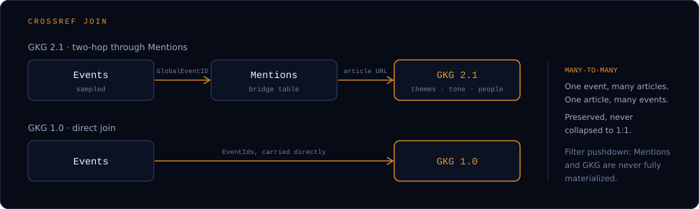

<div class="gf-hero">
  <div class="gf-hero__grid">
    <div>
      
      <h1>Global event data,<br><em>forged.</em></h1>
      <p>Raw GDELT in. Clean, reproducibly-sampled, cross-referenced Parquet out. One CLI, one machine, the whole archive.</p>
      <div class="gf-install"><span class="gf-prompt">$</span> pip install gdeltforge</div>
      <div class="gf-cta">
        <a class="gf-btn gf-btn--primary" href="getting-started/">Get started</a>
        <a class="gf-btn" href="cli-reference/">CLI reference</a>
        <a class="gf-btn" href="https://github.com/Vinicius-Teixeirac/GdeltForge">GitHub</a>
      </div>
      <div class="gf-facts">
        <span><b>542M+</b> rows indexed</span>
        <span><b>1979</b>-present</span>
        <span><b>Apache-2.0</b></span>
      </div>
    </div>
    
  </div>
</div>

<div class="gf-section">
  <p class="gf-eyebrow">The pipeline <span>Five stages. Each one a separate command, re-runnable in isolation.</span></p>
  <div class="gf-grid gf-grid--5">
    <div class="gf-card"><h3>scrape</h3><p>Checksum-verified, concurrent download of the raw archive.</p><span class="gf-card__io">→ CSV</span></div>
    <div class="gf-card"><h3>convert</h3><p>CSV → Parquet, with optional Hive partitioning for historical data.</p><span class="gf-card__io">→ Parquet</span></div>
    <div class="gf-card"><h3>filter</h3><p>Drop rows missing your configured columns.</p><span class="gf-card__io">→ Cleaned</span></div>
    <div class="gf-card gf-card--hot"><h3>sample</h3><p>Seeded reservoir sampling in a single streaming pass.</p><span class="gf-card__io">→ Sample</span></div>
    <div class="gf-card gf-card--hot"><h3>crossref</h3><p>Join a sampled Events output back onto GKG.</p><span class="gf-card__io">→ Sample + GKG</span></div>
  </div>
</div>

<div class="gf-section">
  <p class="gf-eyebrow">Why it exists <span>The full archive is public. Getting it is the hard part.</span></p>
  <div class="gf-grid gf-grid--3">
    <div class="gf-reason"><h3>The GDELT API</h3><p>Built for small, recent queries: tight time windows, a ~250-row cap per query, and rate limits. The full history is out of reach.</p></div>
    <div class="gf-reason"><h3>The BigQuery mirror</h3><p>Complete, but free-tier quotas (1TB query, 10GB storage, 1GB egress) don't cover the hundreds of GB involved, and full scans get expensive.</p></div>
    <div class="gf-reason gf-reason--hot"><h3>The raw bulk archive</h3><p>Complete and free, but thousands of individual files with no tooling. That's the path GdeltForge automates, end to end, locally.</p></div>
  </div>
</div>

<div class="gf-section">
  <p class="gf-eyebrow">What you get</p>
  <div class="gf-grid gf-grid--3">
    <div class="gf-card"><h3>The whole archive</h3><p>The 1979 historical backfill through today, not the last three months the API allows.</p></div>
    <div class="gf-card"><h3>Columnar storage</h3><p>Parquet throughout, with optional Hive partitioning for yearly and monthly historical dumps.</p></div>
    <div class="gf-card"><h3>Transparent lineage</h3><p>Every stage explicit and independently testable. Nothing runs automagically.</p></div>
    <div class="gf-card"><h3>Seven datasets</h3><p>Events (daily, native 15-minute granularity, and the 1979-2013 historical dump), GKG 2.1, legacy GKG 1.0 (plus its separate Counts file), and Mentions, each through the same stages.</p></div>
    <div class="gf-card"><h3>Bundled CAMEO codes</h3><p><code>gdeltforge codes</code> looks up valid values across seven column families, offline.</p></div>
    <div class="gf-card"><h3>Honest scope</h3><p>No orchestration, no VGKG, no hosted infrastructure. The comparison page says when to use something else.</p></div>
  </div>
</div>

<div class="gf-section">
  <p class="gf-eyebrow">Sampling modes <span>Reproducible sampling is a first-class stage, not an afterthought.</span></p>
  <div class="gf-grid gf-grid--2">
    <div class="gf-modes">
      <div class="gf-mode"><b>indexed</b><span>Uniform random across the whole archive.</span></div>
      <div class="gf-mode"><b>calendar</b><span>N rows per period (day, month, or year), evenly across the archive.</span></div>
      <div class="gf-mode"><b>filtered</b><span>JSON column filters, pushed down before sampling; also supports a stratified sub-mode (fixed N per group, balanced classes regardless of the natural distribution).</span></div>
    </div>
    <div class="gf-card">
      <h3>Why it matters</h3>
      <p>Every mode is seeded, so the same command reproduces the same sample. All of them stream over an archive far larger than RAM in a single pass, on one machine, with no cluster or warehouse. See <a href="filtered-sampling/">Filtered Sampling</a> for the full syntax.</p>
    </div>
  </div>
</div>

<div class="gf-section">
  <p class="gf-eyebrow">Crossref <span>Events enriched with GKG, without collapsing the join.</span></p>
  
</div>

## When to reach for what

| Need | Reach for |
|---|---|
| Reproducible, seeded, class-balanced samples of the full Events archive, offline | **GdeltForge** |
| Events enriched with GKG, many-to-many preserved | **GdeltForge** (`crossref`) |
| Recent article/tone queries over a small time window | A DOC 2.0 API client |
| Whole-archive SQL analytics, nothing to install | BigQuery's public dataset |
| An existing Spark or DuckDB pipeline | Stay on it |

See [Comparison to Other Tools](comparison.md) for the full breakdown.

## Quickstart

One week of data, end to end. No config file needed: GdeltForge writes a conservative default on first run.

```bash
pip install gdeltforge

gdeltforge scrape  --dataset events --start-date 2024-01-01 --end-date 2024-01-07
gdeltforge convert --dataset events
gdeltforge filter  --dataset events
gdeltforge sample  --dataset events --mode indexed -n 1000 --out sample.parquet
```

<div class="gf-section">
  <p class="gf-eyebrow">Where to go next</p>
  <div class="gf-grid gf-grid--3">
    <a class="gf-card gf-card--link" href="getting-started/"><h3>Getting Started →</h3><p>Install it and run your first pipeline.</p></a>
    <a class="gf-card gf-card--link" href="cli-reference/"><h3>CLI Reference →</h3><p>Every command, every flag, with real examples.</p></a>
    <a class="gf-card gf-card--link" href="recipes/"><h3>Recipes →</h3><p>Runnable, end-to-end workflows.</p></a>
    <a class="gf-card gf-card--link" href="configuration/"><h3>Configuration →</h3><p>The full <code>settings.yaml</code> reference.</p></a>
    <a class="gf-card gf-card--link" href="architecture/"><h3>Architecture →</h3><p>How the pipeline is put together, and why.</p></a>
    <a class="gf-card gf-card--link" href="limitations-and-roadmap/"><h3>Limitations &amp; Roadmap →</h3><p>What's out of scope, and what's next.</p></a>
  </div>
  <p class="gf-attrib">GdeltForge processes data published by <a href="https://www.gdeltproject.org/">the GDELT Project</a>, which makes it available for unlimited and unrestricted use, provided any use or redistribution includes a citation and a link to their site. GdeltForge itself is an independent, unofficial tool, not affiliated with, endorsed by, or sponsored by the GDELT Project.</p>
</div>
